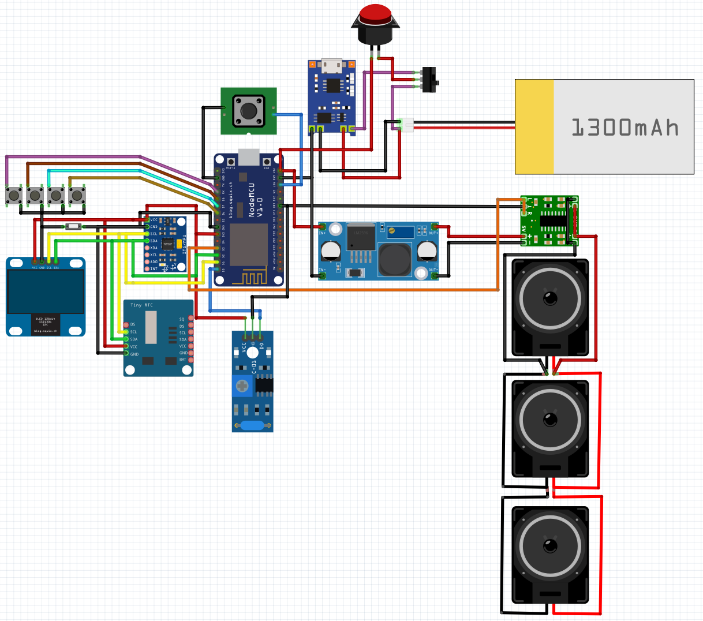

# Earthquake Alarm System

The Earthquake Alarm System is a project built using Arduino and ESP8266 that detects earthquake vibrations using the MPU6050 accelerometer sensor and provides audio and visual alerts during seismic activity.

## Hardware Requirements
To build the Earthquake Alarm System, you will need the following components:

- Arduino or Arduino-compatible microcontroller
- ESP8266 WiFi module
- MPU6050 accelerometer sensor
- RGB LED (3-pin)
- Active Buzzer
- Button sensor (push button)
- Resistors and jumper wires

## Circuit Diagram

The connections should be made as follows:

- Connect the VCC and GND pins of the MPU6050 sensor to the 5V and GND pins of the Arduino, respectively.
- Connect the SDA and SCL pins of the MPU6050 sensor to the SDA and SCL pins of the Arduino, respectively.
- Connect the OUT pin of the tilt sensor to digital pin 16 of the Arduino.
- Connect the positive terminal of the active buzzer to digital pin 0 of the Arduino.
- Connect the RGB LED's red, green, and blue pins to digital pins 13, 15, and 12 of the Arduino, respectively.
- Connect the common cathode of the RGB LED to GND through current-limiting resistors.

## Libraries
The following libraries are used in this project:

- `Arduino.h`: Default Arduino library
- `Wire.h`: Default I2C communication library
- `ESP8266WiFi.h`: Library for WiFi communication with ESP8266
- `WiFiUdp.h`: Library for UDP communication with ESP8266
- `ArduinoJson.h`: Library for parsing JSON data
- `Adafruit_MPU6050.h`: Library for MPU6050 accelerometer sensor
- `Adafruit_Sensor.h`: Sensor library for Adafruit sensors

## Setup
1. Install the Arduino IDE and open it.
2. Install the required libraries listed above in the Arduino IDE's Library Manager.
3. Connect the components according to the circuit diagram provided above.
4. Upload the provided Arduino code to the Arduino board.

## Usage
- Once the system is powered on, the MPU6050 sensor is initialized and starts detecting earthquakes.
- When the tilt sensor detects vibration, the "shock" function is called, providing a mild warning by activating the active buzzer.
- When the MPU6050 sensor detects an earthquake, the "earthquake" function is called, triggering a serious alarm. The RGB LED lights up with red color, and the active buzzer sounds a serious alarm.
- If you wish to switch to a secondary sensor, you can use the "switchSecondarySensor" function (defined without details here).
- The "setRGB" function can be used to set the color of the RGB LED.

## Notes on the Code
- The variable `numberOfAttemptsMPU` controls the number of attempts to initialize the MPU6050 sensor.
- The variable `mpuFound` is a flag that indicates whether the MPU6050 sensor was found successfully during setup.
- The `playWarning` function plays a warning sound when called.
- The `playSiren` function plays a siren sound when called.
- The `eartquik` function is called when an earthquake is detected and triggers a siren.
- The `shock` function is called when the tilt sensor detects vibration and plays a warning sound.
- The `switchSecondarySensor` function can be used to switch to a secondary sensor (not fully defined in the provided code).

## License
This project is open-source and licensed under the MIT License. For more information, see the `LICENSE` file.

## Contributions
If you want to contribute to this project, please submit a pull request. It will be reviewed before acceptance.

## Contact
If you have any questions or suggestions about the project, feel free to email me at example@example.com.

**Note:** This project is for educational purposes and has not been tested for reliability in real-world use. It is recommended to take necessary precautions and perform testing before using it in real-life scenarios.
